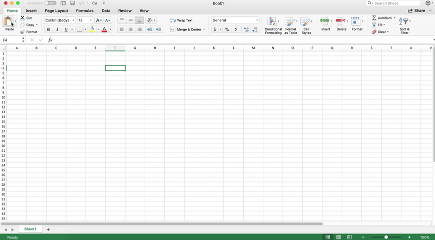
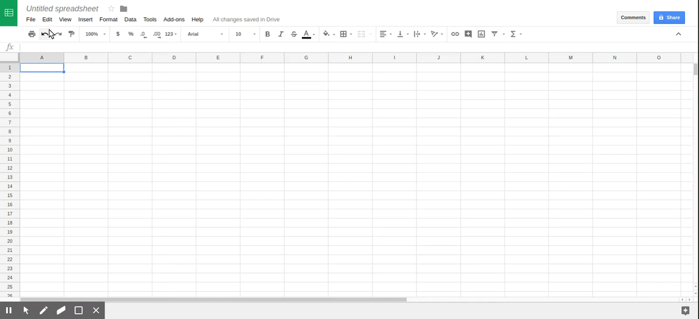

# Vanguard Copy

### Copy
Simply click the clipboard icon in your tool bar to copy all your vanguard account data into your clipboard.

## Paste 
To get this data into Excel:
1. Select the cell you want to be the start of your data
1. Paste
1. From the menu bar up top click "Data"
1. Now click "Text to Columns"
1. Click "Next"
1. Check "Comma"
1. Click "Next"
1. Click "Finish"

Having trouble? Check out the videos below.

To get this data into Sheets:
1. Select the cell you want to be the start of your data
1. Paste
1. From the menu bar up top click "Data"
1. Click "Split text to columns..."  

Having trouble? Check out the videos below.

### Videos

Excel

Sheets

